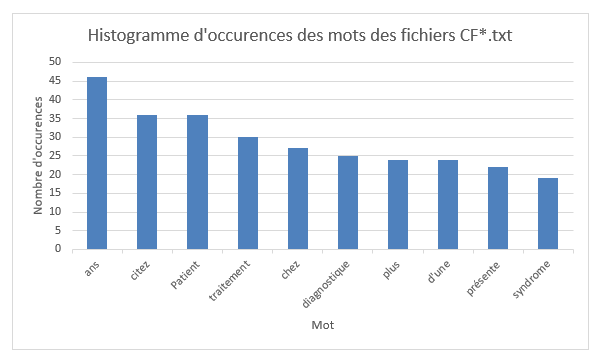
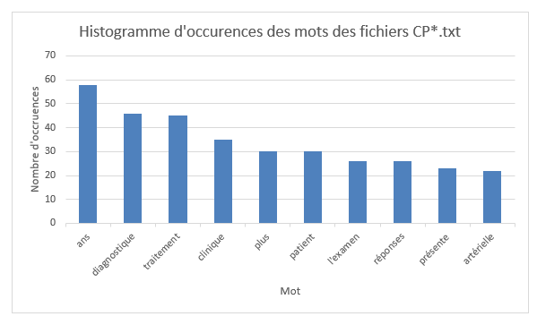

# BigData2020 - 12 Janvier 2020

<br>

Voici le compte rendu du projet de **BigData2020**.<br>
Le programme a été développé en binôme par Guillaume **SAUNIER** et Elliot **THIS**. <br>
Le répository du projet est disponible ici : https://github.com/minisephirot/BigData2020/  <br>
Nous avons fais chacun une moitié de l'exercice et avons passé l'autre moitié a faire de la revue de code du binôme respectif.


## Contenu

|        Fichiers        |Description                          
|----------------|-------------------------------|
|   src/main         |            Dossier des sources
|BigData2020.iml          |Fichier de projet de l'IDE         
|FrequentMining.pdf          |Le sujet du projet
|pom.xml          |Le fichier de dépendances Maven

**Les sources se divisent en deux dossiers :**
- **java** : les sources du programme, se divise en deux fichiers :
  - JavaWordCount.java : les étapes 1 à 4 du sujet pour les fichiers cf et cp.
  - JavaWordMining.java : les étapes 5 à 10 du sujet pour les fichiers cf et cp.
- **resources** : les fichiers .txt utilisés par le programme :
  - cf : le dossier du sujet contenant les logs cf.txt
  - cp : le dossier du sujet contenant les logs cp.txt
  - french-stopwords.txt : Les stopwords.

## Utilisation
Pour chaque partie la première étape est de créer une session Spark pour les différentes manipulations.
####Partie 1 à 4 :
Dans cette partie on commence par créer des **JavaRDD** à partir des différents fichiers que l'on veut étudier :

```JavaRDD<String> linescf = spark.read().textFile("src/main/resources/cf/*").javaRDD();```

On peut, grâce à '*' lire l'integralité des fichiers présents à l'endroit du chemin renseigné.
De la  même manière nous chargeons la liste des mots à retirer des différents documents. On ajoute à cette liste tous les mots déjâ présent mais
avec une majuscule afin de ne pas avoir de soucis de casse :

``stopwords = stopwords.union(stopwords.map(StringUtils::capitalize));``

Ensuite, nous transformons les documents afin d'obtenir un tableau de String. Pour se faire on sépare le document de base
en fonction de la regex "**\s**" qui détecte tous les genres d'espace blanc.

Puis on applique un filtre afin de ne pas garder les différents nombres présents


## Résultats

# Partie Top 10
Pour les fichiers CF :<br>


Pour les fichiers CP :<br>


## Observations et difficultées


## Conclusion
