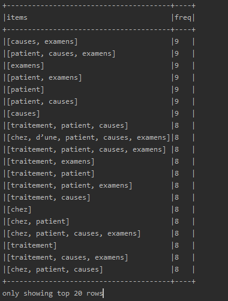
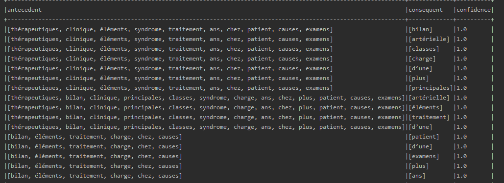

# BigData2020 - 12 Janvier 2020

 

Voici le compte rendu du projet de **BigData2020**. 
Le programme a été développé en binôme par Guillaume **SAUNIER** et Elliot **THIS**.  
Le répository du projet est disponible ici : https://github.com/minisephirot/BigData2020/   
Nous avons fais chacun une moitié de l'exercice et avons passé l'autre moitié a faire de la revue de code du binôme respectif.

## Contenu

|        Fichiers        |Description                          
|----------------|-------------------------------|
|   src/main         |            Dossier des sources
|img          |Dossier des ressources du README.MD
|BigData2020.iml          |Fichier de projet de l'IDE         
|FrequentMining.pdf          |Le sujet du projet
|pom.xml          |Le fichier de dépendances Maven
|trace_exec_top10.txt          |Trace d'execution complète du top10

**Les sources se divisent en deux dossiers :**
- **java** : les sources du programme, se divise en deux fichiers :
  - JavaWordCount.java : les étapes 1 à 4 du sujet pour les fichiers cf et cp.
  - JavaWordMining.java : les étapes 5 à 10 du sujet pour les fichiers cf et cp.
- **resources** : les fichiers .txt utilisés par le programme :
  - cf : le dossier du sujet contenant les logs cf.txt
  - cp : le dossier du sujet contenant les logs cp.txt
  - french-stopwords.txt : Les stopwords.

## Utilisation

**Le plus simple est d'ouvrir le projet dans un IDE**  
Sans IDE vous pouvez faire comme suis :

Se rendre dans la racine du projet:

      mvn clean install
La commande chargera les dépendances du fichier Maven.
Une fois terminé, enregistrez les dépendances dans un jar :

      mvn dependency:copy-dependencies
La commande compilera toute les dépendances dans un jar dans le dossier target/dependency.

On peut désormais run les classes en utilisant les commandes :

    cd target/
    java -cp *nom du jar*.jar:dependency *nom de la classe (JavaWordMining / JavaWordCount)*

-cp définis un class path pour utiliser les classes des dépendances. 
Note: ":" pour Linux/Mac , Windows utilisez ";".

## Fonctionnement
Pour chaque partie, la première étape est de créer une session Spark pour les différentes manipulations.

#### Partie 1 à 4 :

On commence par créer une **JavaRDD** à partir des différents fichiers que l'on veut étudier :

    JavaRDD<String> linescf = spark.read().textFile("src/main/resources/cf/*").javaRDD();

On peut, grâce à '*' lire l'integralité des fichiers présents à l'endroit du chemin renseigné.
De la  même manière, nous chargeons la liste des mots à retirer des différents documents. On ajoute à cette liste tous
les mots déjâ présent mais avec une majuscule afin de ne pas avoir de problèmes de casse :

    stopwords = stopwords.union(stopwords.map(StringUtils::capitalize));

Ensuite, nous transformons les documents afin d'obtenir un tableau de String. Pour ce faire, on sépare le contenu des documents de base
en fonction de la regex suivante `\s` qui détecte tous types d'espace blanc.

Puis on applique un filtre afin de ne pas garder les différents nombres présents ainsi que les valeurs vides. Un fois le filtrage fait on soustrait des valeurs les mots du fichier stopwords :

    words = words.subtract(stopwords);

On associe ensuite une occurence à chaque mot pour pouvoir les comptabiliser:

    JavaPairRDD<String, Integer> ones = words.mapToPair(s -> new Tuple2<>(s, 1));
Puis on somme les occurences sur les clé:
    
    JavaPairRDD<String, Integer> counts = ones.reduceByKey(Integer::sum);

Et finalement, nous affichons les 10 premiers mots, classés par ordre de fréquence.

#### Partie 5 à 10

Dans cette partie, on récupére tout d'abord le dossier contenant tous les fichiers à traiter.
Ensuite on va ajouter une transaction par document en parcourant le dossier. 

Pour chaque document, on transforme le fichier en un String sur lequel on applique exactement les mêmes transformations et filtres que dans la première partie :
    
    String load = new String(Files.readAllBytes(Paths.get(f.getPath())));

Une fois les transformations terminées, nous créons la transaction correspondante :

    tab.add(RowFactory.create(Arrays.stream(SPACE.split(load)).distinct().collect(Collectors.toList()))) ;

Et ajoutons par la suite l'ensemble des transactions à notre session Spark : 

    Dataset<Row> lines = spark.createDataFrame(tab, schema);
    
Après cela, comme pour la première partie, il faut retirer des documents les mots du stopwords. 
Pour cela, on utilise la classe StopWordsRemover de la bibliotèque Spark, qui permet, à partir d'une liste de String, de les retirer d'un Dataset.

    StopWordsRemover remover = new StopWordsRemover();
    remover.setStopWords((String[]) stopwords.toArray());
    lines = remover.transform(lines);
    
Ensuite, il faut choisir soit d'utiliser le "frequent itemset mining algorithm" en variant le support, soit, 
d'utiliser l'"association rules algorithm " en variant la confidence. Et on classe les différents résultats par
odre de fréquence pour le premier et par rapport à la confiance pour le deuxième.

    model.freqItemsets().orderBy(functions.col("freq").desc()).show(false);
    model.associationRules().orderBy(functions.col("confidence").desc()).show(false); 

## Résultats

### Partie Top 10
Pour les fichiers CF : 

Pour les fichiers CP : 

### Partie Mining

** Le set de données utilisées est : dossier cf, minsupp = 0.5, minconf = 0.5. **

Pour les fichiers CF : 

Pour les fichiers CP : 

## Observations et difficultés

#### Observations

Pour la première partie on voit directement que Spark permet un traitement rapide de nombreux fichiers. Cela permet
de tirer une grande quantité de données d'une base de document assez rapidement.

Et en ce qui concerne la seconde partie, elle va permettre une étude plus poussée de ces différents documents avec diverses recherches. 
Par exemple,sur la fréquence d'apparition d'un ensemble de mot sur des documents, avec des résultats triés en fonction du support. Il correspond à la fraction à laquelle doit correspondre l'apparition de cette ensemble dans les différents documents.

De par la définition de minsupport, plus on s'approche de zéro plus la quantitée de donnée à traiter de données augmente.

Ou alors, la recherche peut aussi se porter sur la confiance. Elle cherche à montrer l'implication d'un mot par rapport à un autre, c'est à dire la probabilité de présence d'un mot si un premier mot défini est apparu.

#### Difficultés

La plus grosse difficulté était de comprendre et d'utiliser les différentes fonctionnalités de Spark, ce à cause d'une documentation pour certaines classes minimalistes. Cependant grâce à divers exemples nous nous sommes appropriés l'outil. 
Certains points nous ont posés problèmes :
* Au début, nous pensions que la longueur d’exécution sur un minsupp faible venait de notre programme alors qu'en réalité c'est la quantité de donnée qui empêche notre programme de terminer (avec des erreurs de type "not enough Java heap memory).
* Certains problèmes "mêta" du projet, comme définir le chemin d'accès de hadoop que nous avons dû spécifier en dur, des dépendances inaccessibles dans le scope de la compilation etc.

## Conclusion

En conclusion Spark est un outil très puissant, permettant l'analyse et le traitement de fichiers, malgré une prise en main laborieuse. On a pu à partir de ce TP voir deux méthodes pour charger des documents dans Spark avec les JavaRDD et les Dataset. Ils permettent par la suite une étude différente d'un ensemble de documents. La première permet une description du contenu tandis que la deuxième va permettre une analyse et une comparaison des contenus des différents documents.
